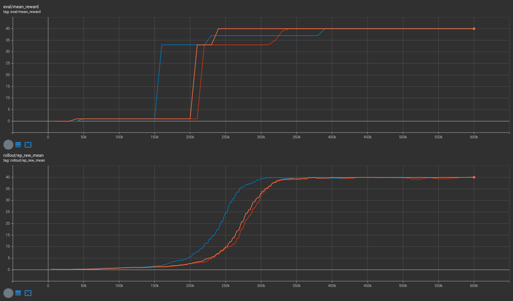
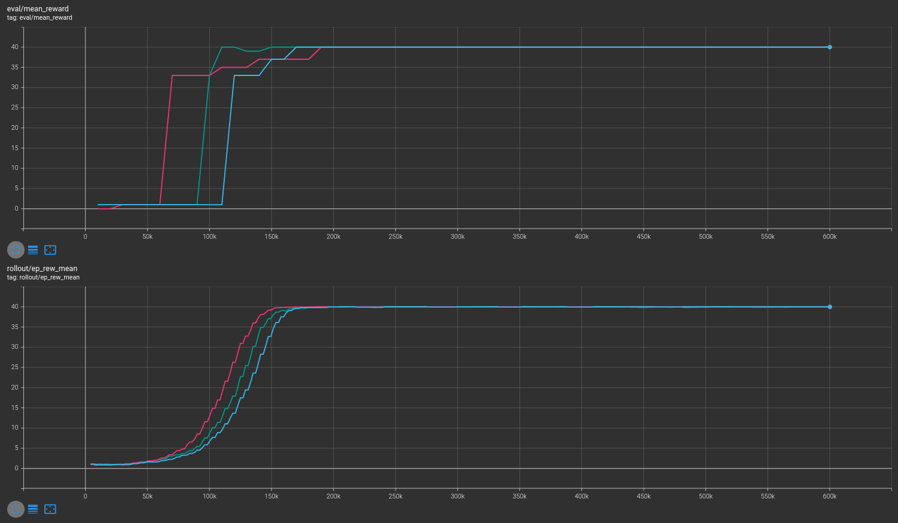
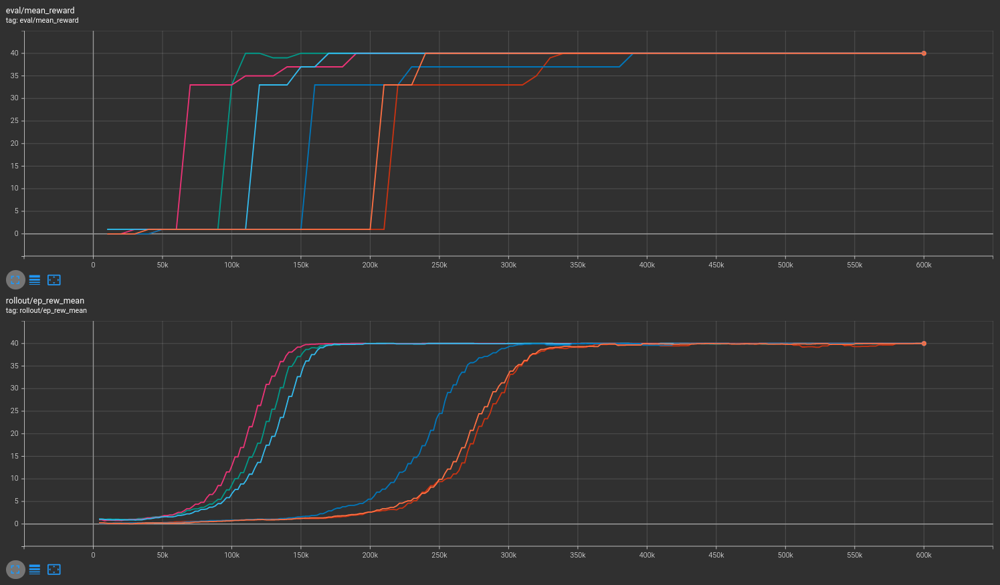
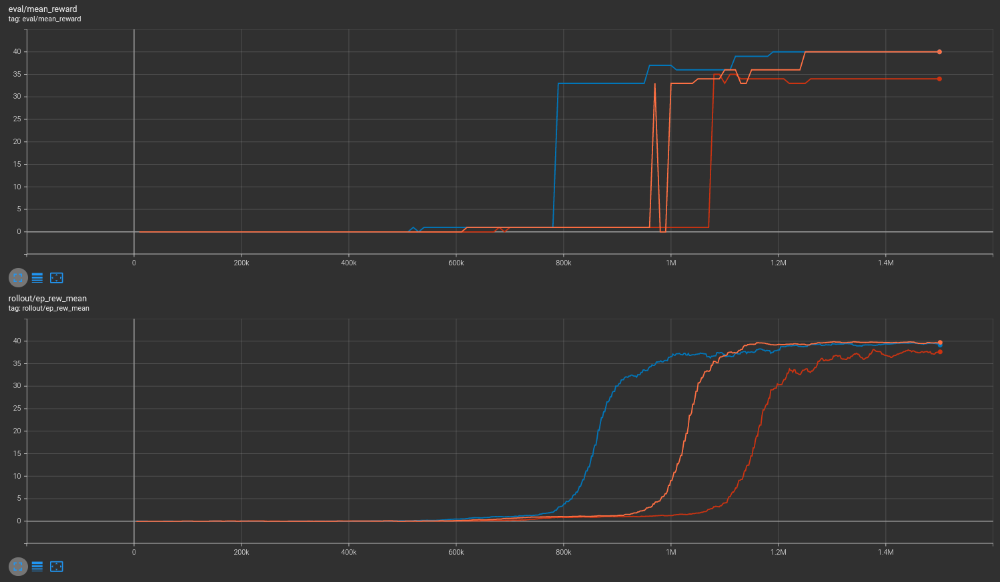
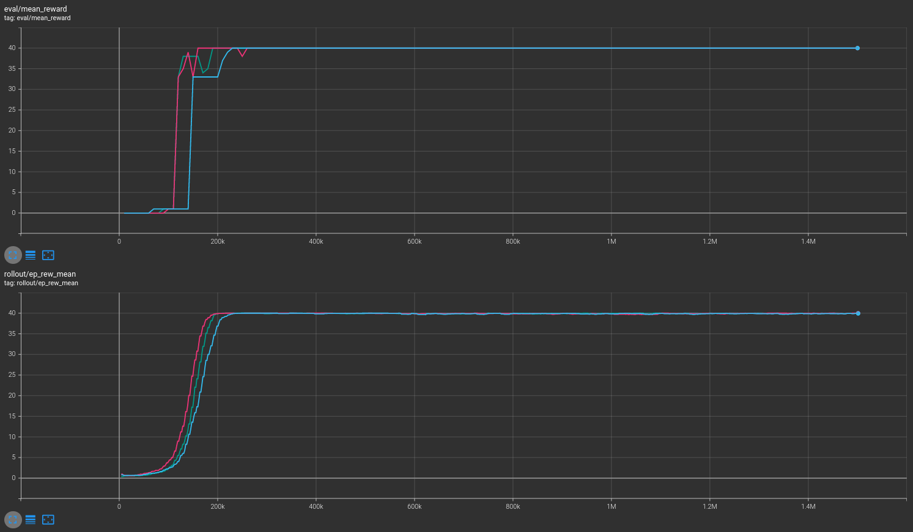
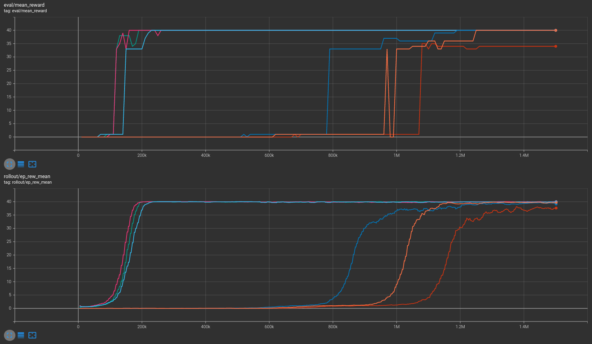

# MicroRTS PPO Performance Comparsion

This repo attempts to reproduce the results of the PPO model found in
[the source code](https://github.com/vwxyzjn/invalid-action-masking)
for the paper [*A Closer Look at Invalid Action Masking in Policy Gradient Algorithms*](https://arxiv.org/abs/2006.14171).
The original implementation is compared against a new model using Stable Baselines 3's PPO implementation, or sb3-contrib's MaskablePPO when invalid action masking is enabled.

## Installation

You should already have Python 3.8+, Java 8+, and CUDA 10.1+ installed.

Install MicroRTS JAR:
```bash
rm -fR ~/microrts && mkdir ~/microrts && \
    wget -O ~/microrts/microrts.zip http://microrts.s3.amazonaws.com/microrts/artifacts/202004222224.microrts.zip && \
    unzip ~/microrts/microrts.zip -d ~/microrts/
```

Then install the necessary Python packages:
```

```bash
pip install -r requirements.txt
```

## Running

### Original implementation

```bash
python original/new_train_ppo_4x4.py
```

Note that this script is functionally identical to
[the original found here](https://github.com/vwxyzjn/invalid-action-masking/blob/54bfb37b939e8f9e77dcf96f79b7df4953e012f2/ppo.py).

### Stable Baselines 3 (SB3) implementation

```bash
# No masking
python sb3/train_ppo.py zoo [size]  # Size may be 4 or 10

# Masking enabled
python sb3/train_ppo.py zoo [size] --mask  # Size may be 4 or 10
```

This script makes use of SB3's [core PPO algorithm](https://stable-baselines3.readthedocs.io/en/master/modules/ppo.html) by default. If masking is enabled, sb3-contrib's [MaskablePPO](https://github.com/Stable-Baselines-Team/stable-baselines3-contrib/pull/25) is used instead.

## Results

### SB3

The results in the zoo were produced via the following commands:
```bash
# 4x4 unmasked
python sb3/train_ppo.py zoo 4
python sb3/train_ppo.py zoo 4  --seed 43
python sb3/train_ppo.py zoo 4  --seed 44

# 4x4 masked
python sb3/train_ppo.py zoo 4  --mask
python sb3/train_ppo.py zoo 4  --mask --seed 43
python sb3/train_ppo.py zoo 4  --mask --seed 44

# 10x10 unmasked
python sb3/train_ppo.py zoo 10
python sb3/train_ppo.py zoo 10  --seed 43
python sb3/train_ppo.py zoo 10  --seed 44

# 10x10 masked
python sb3/train_ppo.py zoo 10  --mask
python sb3/train_ppo.py zoo 10  --mask --seed 43
python sb3/train_ppo.py zoo 10  --mask --seed 44
```

You may view the results in the zoo for yourself by running:
```bash
# For 4x4 environment
tensorboard --logdir zoo/4x4/runs

# For 10x10 environment
tensorboard --logdir zoo/10x10/runs
```

#### 4x4 Environment

##### No masking



##### Masking



##### Compared



#### 10x10 Environment

##### No masking



##### Masking



##### Compared


